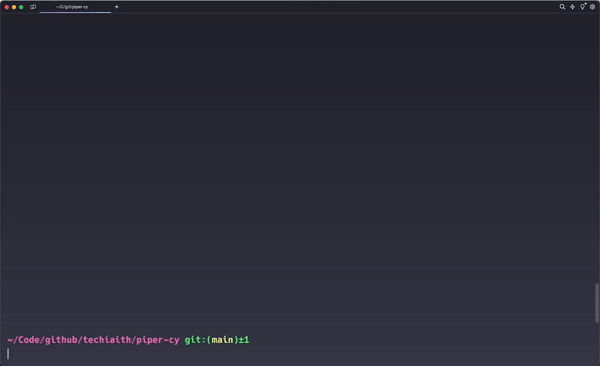

# Piper-cy

<!-- ABOUT THE PROJECT -->
## Ynglŷn â'r Project
<span id="about"></span>
Y cod ffynhonnell agored sydd y tu ôl i https://trawsgrifiwr.techiaith.cymru yw cynnwys y storfa (repo) hon. Mae'r project yn lapio gwasanaeth adnabod lleferydd yr [Uned Technolegau Iaith](http://techiaith.cymru) mewn rhyngwyneb syml ar gyfer creu isdeitlau Cymraeg.


<!-- GETTING STARTED -->
## Cychwyn Arni

I gael copi lleol ar waith dilynwch y camau hyn.

### Rhagofynion

* [docker](https://docker.com)
* [docker-compose](https://docs.docker.com/compose/install/)

Mae docker-compose bellach yn cael ei osod gyda DockerDesktop. Fodd bynnag os nad yw'r ategyn `docker compose` ar gael yn eich gosodiad yna dilynwch y cyfarwyddiadau gosod gan Docker.

### Gosod

1. Cloniwch y storfa

   ```sh
   git clone https://github.com/techiaith/piper-cy.git
   ```
      
<!-- USAGE EXAMPLES -->
## Defnydd

```sh
docker compose run piper 

root@21d3f7f1bb68:/# echo "Croeso i'r byd testun i leferydd!" | \
  ./piper --model /models/gwryw-gogleddol.onnx --output_file /exports/croeso.wav
```

Ewch i'r ffolder `/exports/` ar eich peiriant lleol a chwiliwch am y ffeil `croeso.wav`.



<!-- ROADMAP -->
## Map ffordd

- [ ] Lleisiau all-lein Android
- [ ] Lleisiau all-lein iOS
- [ ] Modelau aml-siaradwr

Ar hyn o bryd rydym yn cynllunio nodweddion newydd, dewch yn ôl yn fuan i gael cipolwg arnynt neu ychwanegwch eich barn trwy'r issue tracker.

Gweler yr [issues agored ](https://github.com/techiaith/piper-cy/issues) am restr lawn o nodweddion arfaethedig (a materion hysbys). 

<!-- CONTRIBUTING -->
## Cyfrannu

Cyfraniadau yw'r hyn sy'n gwneud y gymuned cod agored yn lle mor anhygoel i ddysgu, ysbrydoli a chreu. Bydd unrhyw gyfraniadau a wnewch yn cael eu **gwerthfawrogi'n fawr**.


Os oes gennych awgrym a fyddai'n gwneud yr adnodd hwn yn well, fforchiwch y storfa a chrëwch pull request.
Gallwch hefyd agor problem gyda'r tag "enhancement".
Peidiwch ag anghofio rhoi seren i'r project! Diolch eto!


1. Creu fforch
2. Creu eich Cangen Nodweddion (Feature Branch) `git checkout -b feature/AmazingFeature`
3. Cyflwyno (Commit) eich Newidiadau `git commit -m 'Add some AmazingFeature'`
4. Gwthio (Push) i’r gangen `git push origin feature/AmazingFeature`
5. Agor Pull Request

<!-- LICENSE -->
## Trwydded

Wedi'i ddosbarthu dan Drwydded MIT. Gweler `LICENSE.txt` am ragor o wybodaeth.


<!-- CONTACT -->
## Cysylltu

Techiaith - [@techiaith](https://twitter.com/techiaith) - techiaith@bangor.ac.uk - [techiaith.cymru](techiaith.cymru)

Project Link: [https://github.com/techiaith/piper-cy](https://github.com/techiaith/piper-cy)


<!-- ACKNOWLEDGMENTS -->
## Diolchiadau


<br><br><br><br><br>
Diolchwn i Lywodraeth Cymru am ariannu’r gwaith hwn fel rhan o brosiect Technoleg Cymraeg 2021-22.

