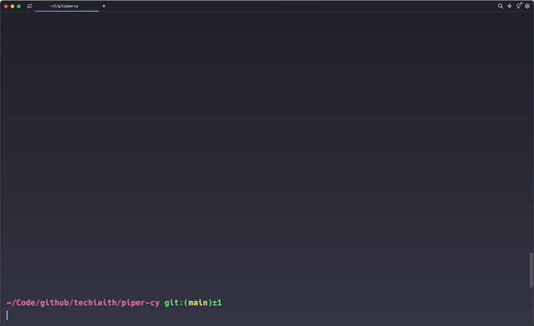

# Piper-cy

<!-- ABOUT THE PROJECT -->
## About The Project
<span id="about"></span>
This repository leverages the work of [Piper](https://github.com/rhasspy/piper) to provide offline usage and access to the pre-trained text-to-speech (TTS) models available from the [Uned Technolegau Iaith](http://techiaith.cymru). [Piper](https://github.com/rhasspy/piper) is already used in a variety of [open-source projects] (https://github.com/rhasspy/piper#people-using-piper) but we hope this repository will also serves as a forum to advance the use of Welsh TTS on as many platforms as possible.

In the repo you will find pre built [onnx](https://onnxruntime.ai) models for the [Piper](https://github.com/rhasspy/piper) framework. You can follow their instructions to build for you use case or via the [docker](https://docker.com) container in this repo. You will also find the models converted for use with the [sherpa-onnx](https://github.com/k2-fsa/sherpa-onnx) project which contains several examples of local inference on a variety of devices.	

<!-- GETTING STARTED -->
## Getting Started

To get a local copy up and running follow these steps.

### Prerequisites

* [docker](https://docker.com)
* [docker-compose](https://docs.docker.com/compose/install/)

Docker-compose is now shipped with DockerDesktop, however if the `docker compose` plugin is not available in your installation then follow the install instructions.

### Installation

1. Clone the repo

   ```sh
   git clone https://github.com/techiaith/piper-cy.git
   ```

<!-- USAGE EXAMPLES -->
## Usage

Start the container

```sh
docker compose run piper 

root@21d3f7f1bb68:/# echo "Croeso i'r byd testun i leferydd!" | \
  ./piper --model /models/gwryw-gogleddol.onnx --output_file /exports/croeso.wav
```

Navigate to the `/exports/` folder on your local machine and look for the `croeso.wav` file to play in any audio player.




<!-- ROADMAP -->
## Roadmap

- [ ] Offline Android Inference
- [ ] Offline iOS Inference
- [ ] Mult-Speaker Models

We are currently planning out new features, please check back soon or add your opinion via the 
[issue](https://github.com/techiaith/piper-cy/issues) tracker.

See the [open issues](https://github.com/techiaith/piper-cy/issues) for a full list of proposed features 
(and known issues).

<!-- CONTRIBUTING -->
## Contributing

Contributions are what make the open source community such an amazing place to learn, inspire, and create. 
Any contributions you make are **greatly appreciated**.

If you have a suggestion that would make this better, please fork the repo and create a pull request. 
You can also simply open an issue with the tag "enhancement".
Don't forget to give the project a star! Thanks again!

1. Fork the Project
2. Create your Feature Branch `git checkout -b feature/AmazingFeature`
3. Commit your Changes `git commit -m 'Add some AmazingFeature'`
4. Push to the Branch `git push origin feature/AmazingFeature`
5. Open a Pull Request

<!-- LICENSE -->
## License

Distributed under the MIT License. See `LICENSE.txt` for more information.

<!-- CONTACT -->
## Contact

Techiaith - [@techiaith](https://twitter.com/techiaith) - techiaith@bangor.ac.uk - [techiaith.cymru](techiaith.cymru)

Project Link: [https://github.com/techiaith/piper-cy](https://github.com/techiaith/piper-cy)

<!-- ACKNOWLEDGMENTS -->
## Acknowledgments


<br><br><br><br><br>
We thank the Welsh Government for funding this work as part of the Technoleg Cymraeg 2021-22 project.
